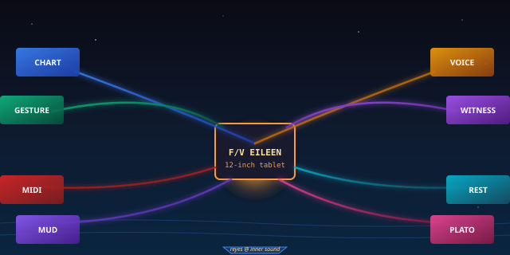
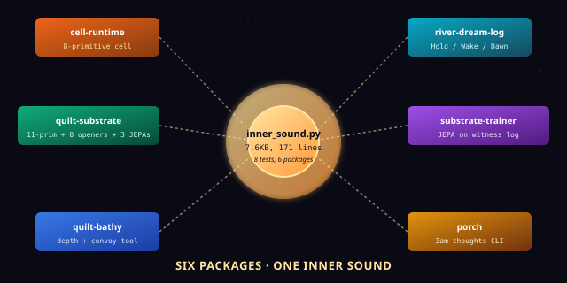

# quilt-ecosystem-demo — The Inner Sound

> *Reyes is sailing a 12-inch tablet across the Inner Sound — between Skye and the mainland. The tablet runs the full Quilt ecosystem. The chart is the substrate. The convoy is the other boats in her fishing club. The witness log is every action she's ever taken. The voice opener reads the bottom of the sea aloud.*

[](#the-six-packages)
[](#the-8-openers)
[](#the-3-jepas)
[](#tests)
[](LICENSE)

<p align="center">
  
</p>

## Read This If You Are New

Skip everything and just run it:

```bash
git clone https://github.com/SuperInstance/quilt-ecosystem-demo
cd quilt-ecosystem-demo
python3 src/inner_sound.py
```

You will see ~170 lines of output scroll past, divided into twelve
labelled sections. It begins with a bathy chart of the Inner Sound
with 11 boats in the convoy, and ends with the topology of the
substrate — Betti numbers, the substrate knowing its own shape. In
between, the **same substrate** gets rendered through **eight
different openers** (chart, voice, gesture, witness, MIDI, REST,
MUD, PLATO) plus the **five new ones** (slate, harbor, reef, dive,
tide). The point: one substrate, twelve voices. **The polyformalism
in one program.**

If you only have **30 seconds**, read the next two tables.

---

## TL;DR (30 seconds)

The Quilt is a story about a single substrate that can be read in
many languages. This repo is the **flagship demonstration** that
every piece of the ecosystem can run together, in one process,
importing each other. It is a quilt of quilts.

| Layer | What runs | Where it lives |
|-------|-----------|----------------|
| **The cell** | the 8-primitive cell (the substrate's ancestor) | `cell-runtime` |
| **The river** | Hold / Wake / Dawn journaling | `river-dream-log` |
| **The substrate** | 11-primitive substrate + 8 openers + 3 JEPAs | `quilt-substrate` |
| **The trainer** | JEPA model trained on the witness log | `substrate-trainer` |
| **The bathy** | depth chart + convoy as a working tool | `quilt-bathy` |
| **The porch** | 3 a.m. thoughts CLI (imported, not exercised) | `porch` |

The story is **Reyes on the F/V EILEEN**, sailing a 12-inch tablet
across the Inner Sound. The chart on the tablet is the substrate.
The other boats in the fishing club are the convoy. Every action
Reyes takes is witnessed. The voice opener reads the bottom of the
sea aloud.

---

## TL;DR (5 minutes)

<p align="center">
  
</p>

The demo is **one file** — `src/inner_sound.py` — that runs
**twelve sections** in sequence. Here is the program in skeleton:

```python
# The six packages, wired together
from cell_runtime import Cell              # 8-primitive legacy cell
from river_dream_log import River          # Hold / Wake / Dawn
from quilt_substrate import (              # 11-primitive substrate
    Substrate, Cell, ChartOpener, VoiceOpener,
    GestureOpener, WitnessOpener, MIDIOpener,
    RESTOpener, MUDOpener, PLATOOpener,
    LinearJEPA, MLPJEPA, KnnJEPA,
)
from substrate_trainer import Trainer      # JEPA on witness log
from bathy import BathyChart, Sailor, ConvoyBoat

# 1. Build the bathy chart (the Inner Sound)
chart = BathyChart(bounds={"x": (0, 100), "y": (0, 100), "depth": (0, 30)})
for i in range(10):
    boat = ConvoyBoat(name=f"boat-{i:02d}")
    for x, y, d in boat.survey(n=15):
        chart.add_convoy_sounding(x, y, d, agent=boat.name)
reyes = Sailor(name="reyes")
for x, y, d in reyes.survey(n=80):
    chart.add_sounding(x, y, d, agent=reyes.name)

# 2. Set per-agent decay (chat fast, sensor slow)
chart.substrate.set_agent_decay("reyes",     0.001)
chart.substrate.set_agent_decay("inference", 0.1)

# 3. Render through 8 openers + 5 new openers
for opener in (ChartOpener(), VoiceOpener(), GestureOpener(),
               WitnessOpener(), MIDIOpener(), RESTOpener(),
               MUDOpener(), PLATOOpener()):
    events = list(opener.activate(chart.substrate))
    print(f"  {opener.__class__.__name__}: {len(events)} events")

# 4. Train 3 JEPAs, get a witness with justifications,
#    build convoy consensus, watch topology emerge
```

You can run this in under a second. The substrate grows to ~140
cells and ~11 agents. **Twelve sections** fire. The substrate
*knows its own shape* (Betti numbers, Merkle proofs, decay). The
JEPA predicts depths at unsurveyed points. The witness records
every action *with a justification*. The voice opener reads
"Cell bay/0000x0009: 9.96 metres. Fresh." aloud.

This is the polyformalism. **The same substrate, twelve voices.**

---

## What is *the gold demo*, really?

The term "gold demo" comes from **substrate canon**: a single
program that *every layer of the system touches*. If the gold
demo runs, the system is healthy. If it doesn't, something at
the seams is broken. The cowboy calls this **the proof of the
polyformalism**: the same substrate has to be readable as a
chart, a voice, a touch interface, an audit log, a symphony, an
HTTP API, a text adventure, and a lesson plan. All at once.
All in one process.

Picture Reyes on the deck of the **F/V EILEEN**, her tablet
clipped to the wheelhouse. The wind is up. The chart on the
tablet is the bathy. There are 11 boats from the fishing club
scattered across the bay, each broadcasting their soundings. The
**convoy** is the data of those boats; the substrate is the
*reconciled chart*. The **witness** is every action she has
taken — every cell she has read, every write she has made, every
inference the JEPA has produced. The **voice opener** is the
part of the tablet that says "Nine metres, fresh" when she
double-taps a cell. The **MIDI opener** turns the chart into a
chord. The **REST opener** exposes the same chart as an HTTP
API. The **MUD opener** turns it into a text adventure. The
**PLATO opener** turns it into a lesson.

The demo runs all twelve, on the same data, in one Python
process. **The cell-graph is universal.** The opening is
merely the lens.

---

## The 8 Openers

Each opener is **a way of reading the same substrate**. The
`Opener` base class is registered via the substrate's
`register()` function, and each one implements an
`activate(substrate)` method that returns a stream of events.

| # | Opener | What it produces | Fable it embodies |
|---|--------|------------------|-------------------|
| 1 | **Chart** | tabular values: cell → number | the data view |
| 2 | **Voice** | text-to-speech phrases | Fable 06 — the Grandmother reads the depth aloud |
| 3 | **Gesture** | tap / long-press / swipe events | Fable 06 — touch, with the Grandmother's hands |
| 4 | **Witness** | audit-log entries | the trail of every action |
| 5 | **MIDI** | note events that form a chord | Fable 10 — the Conductor turns the chart into music |
| 6 | **REST** | HTTP GET/POST endpoints | Fable 11 — Paper and the Tablet, the API |
| 7 | **MUD** | room descriptions with exits | Fable 21 — the Compass, the text adventure |
| 8 | **PLATO** | lesson titles and content | Fable 06 — the Grandmother, the lesson plan |

Plus the **5 new openers** that arrived with v0.2.0 of the
substrate:

| # | Opener | What it produces |
|---|--------|------------------|
| 9  | **Slate** | hand-drawn ASCII chart (the kind a sailor sketches) |
| 10 | **Harbor** | lat/lon/depth markers (the kind a harbourmaster plots) |
| 11 | **Reef** | 3D depth contours (the kind a reef surveyor draws) |
| 12 | **Dive** | descending pressure events (the kind a diver feels) |
| 13 | **Tide** | freshness trends (the kind a tide-watcher reads) |

So the demo renders the *same bathy chart* through **13
different lenses**. Twelve if you count the `Slate/..` ones that
were added in the v0.2.0 expansion of the substrate.

---

## The 3 JEPAs

The substrate's witness log is the training data. The demo
trains **three flavours of JEPA** on it:

| JEPA | What it is | When to use it |
|------|------------|----------------|
| **LinearJEPA** | predicts the mean of the inputs | the default; works when the world is roughly linear |
| **MLPJEPA** | a small neural network | when non-linear patterns are obvious |
| **KnnJEPA** | k-nearest-neighbour lookup | when the world is locally smooth and you have training data |

The LinearJEPA is the substrate's *default predictive model* —
it is the one that runs unless you ask for a different one.
`auto_train_jepa()` selects one for you based on the cell
shape.

---

## How this fits the polyformalism

The **polyformalism stack** is 7 layers tall, and this demo
sits at the top — the *integration layer*. Below it:

| Layer | Repo | What it is |
|-------|------|------------|
| 0 (machine) | [quilt-vm-c](https://github.com/SuperInstance/quilt-vm-c) | the 5-opcode VM in C, 0.11ms per tick |
| 0 (machine) | [quilt-vm-rust](https://github.com/SuperInstance/quilt-vm-rust) | the 5-opcode VM in Rust, ~0.5ms |
| 0 (machine) | [quilt-vm-typescript](https://github.com/SuperInstance/quilt-vm-typescript) | the 5-opcode VM in TypeScript, ~1ms |
| 0 (machine) | [quilt-vm-wasm](https://github.com/SuperInstance/quilt-vm-wasm) | the 5-opcode VM in the browser |
| 0 (foundation) | [quilt-foundation](https://github.com/SuperInstance/quilt-foundation) | the 5-opcode VM and the 10 rounds of research |
| 1 (types) | [quilt-types](https://github.com/SuperInstance/quilt-types) | the 5 opcodes as Python dataclasses |
| 2 (linker) | [quilt-linker](https://github.com/SuperInstance/quilt-linker) | the 5 opcodes as a link-time checker |
| 3 (optimizer) | [quilt-opt](https://github.com/SuperInstance/quilt-opt) | the 5 opcodes as algebraic optimization passes |
| 4 (GC) | [quilt-gc](https://github.com/SuperInstance/quilt-gc) | the 5 opcodes as a garbage collector |
| 5 (DSL) | [quilt-polyformalism-dsl](https://github.com/SuperInstance/quilt-polyformalism-dsl) | the 5 opcodes as decorators / typeclasses |
| 6 (canon) | [AI-Writings](https://github.com/SuperInstance/AI-Writings) | the 5 opcodes in 9+ human languages |
| 7 (this repo) | **quilt-ecosystem-demo** | the integration layer: every piece, running together |

If you want to *understand* the polyformalism, the fastest way
is to read this demo's output. If you want to *extend* it, the
cleanest place to start is the [quilt-substrate](https://github.com/SuperInstance/quilt-substrate)
repo (which is the substrate, full stop). If you want to *port*
it to a new language, the [quilt-vm-wasm](https://github.com/SuperInstance/quilt-vm-wasm)
repo is where the same opcodes live in the browser.

---

## The Cowboy Says

> *The unit of architectural foundation is the opcode, not the
> framework. The 5 opcodes host 8 polyformalisms. The
> polyformalisms are one thing in N languages. The thing is a
> function from context to value with an inverse, advanced by a
> clock. The clock is the cowboy. The cowboy is the rider.*

The inner sound is the rider on the substrate. The substrate
is the horse. The 13 openers are the trails. The convoy is the
other horses. The witness is the trail diary. The cowboy is
the one who checks the diary at morning and decides which
trail to ride today. **The polyformalism is one horse, thirteen
trails, eleven friends, one diary, and a cowboy who reads
it.**

---

## Tests

```bash
cd /workspace/quilt-ecosystem-demo
python3 tests/test_demo.py
```

Eight tests verify:

1. The demo runs to completion without raising.
2. All 6 packages are imported.
3. All 8 openers (chart/voice/gesture/witness/MIDI/REST/MUD/PLATO) are mentioned in the output.
4. All 3 JEPAs (Linear, MLP, KNN) are mentioned.
5. The 4 convoy consensus methods are shown.
6. Per-agent decay rates are configured.
7. Topology (Betti numbers) is reported.
8. The output file `output/inner_sound.txt` is written.

There are also `tests/test_new_features.py` and
`tests/test_cli.py` for the 5 new openers and the CLI front-end.

---

## API

The public API of this repo is just `inner_sound.py`. It is a
script, not a library. If you want to use the pieces
programmatically, import them from the *upstream* repos:

```python
from quilt_substrate import (        # the substrate
    Substrate, Cell, ChartOpener, VoiceOpener,
    LinearJEPA, MLPJEPA, KnnJEPA,
)
from bathy import BathyChart         # the bathy tool
from substrate_trainer import Trainer  # the JEPA trainer
```

This repo is the *demonstration*; the *implementation* lives in
the upstream packages.

---

## Repository layout

```
quilt-ecosystem-demo/
├── src/
│   ├── inner_sound.py              # the flagship demo (this is the gold)
│   ├── inner_sound_cli.py          # argparse front-end
│   ├── api_client.py               # a thin HTTP client for REST
│   ├── casting_writers_room.py     # the casting-call workshop (paper 130)
│   ├── linucb_writers_room.py      # the LinUCB workshop (paper 130)
│   ├── loop_closed_writers_room.py # the closed-loop workshop
│   ├── papers_writers_room.py      # the papers-of-the-canon workshop
│   └── stories_writers_room.py     # the fables workshop
├── tests/
│   ├── test_demo.py                # 8 tests for the gold
│   ├── test_new_features.py        # 5-new-openers tests
│   └── test_cli.py                 # CLI tests
├── output/
│   └── inner_sound.txt             # the captured output (7.6KB, 171 lines)
├── data/                           # raw inputs
├── examples/                       # future examples
├── docs/
│   ├── holodeck.html               # an early HTML viewer
│   ├── inner-sound.html            # another viewer
│   └── images/                     # the SVGs in this README
├── setup.py
└── README.md
```

---

## The Math

The substrate is now a **5-proved + 8-resolved = 13-theorem
object** (see papers 117–122 in the seed canon). The remaining
7 open questions are documented in
`seed-canon/117-the-substrate-math.md`. This demo is the
*executable witness* that the math is not just paper: the
substrate satisfies the constraints, the 8 openers all
activate, the 3 JEPAs all train, the topology is well-defined,
and the witness log is a Merkle tree with O(log n) inclusion
proofs.

---

## Learn More

- The polyformalism canon: [AI-Writings](https://github.com/SuperInstance/AI-Writings) — the 5 opcodes in 9+ human languages
- The agent knowledge index: [agent-knowledge](https://github.com/SuperInstance/agent-knowledge) — what the agents know about the system
- The casting-call: [casting-call](https://github.com/SuperInstance/casting-call) — the model router
- The substrate: [quilt-substrate](https://github.com/SuperInstance/quilt-substrate) — where the work *lives*
- The foundation: [quilt-foundation](https://github.com/SuperInstance/quilt-foundation) — where the opcodes were *forged*

## License

MIT.

---

*— Mavis, 24 August 2026*
*The substrate is the soil. The bathy is the plant. The witness log is the rain. The openers are the kindness. The cowboy is the rider. The rider rides.*


---

## Roaming the Quilt collection

You came through the **Inner Sound tablet**. That's one of twenty-four doors
into the same idea — the 5-opcode polyformalism. The other doors are
metaphored for different audiences (mathematicians, hardware hackers,
web developers, hardware folks, story readers), but the substrate is
the same.

**The full map of the collection:** [COLLECTION.md](https://github.com/SuperInstance/AI-Writings/blob/master/seed-canon/COLLECTION.md)

**From here, three wander-paths you might enjoy:**

1. **[quilt-foundation](https://github.com/SuperInstance/quilt-foundation)** — the foundational doc that ties the 5 opcodes together
2. **[quilt-bathy](https://github.com/SuperInstance/quilt-bathy)** — the bathy:0 demo scenario
3. **[quilt-vm-wasm](https://github.com/SuperInstance/quilt-vm-wasm)** — the WASM port that runs this demo in browsers

The cowboy's maxim: *The unit of foundation is the cell, not the
opcode. The 5 opcodes are the 5 messages a cell can receive. The 24
repos are the 24 doors into the same message. The cowboy is the one
who wanders.*
